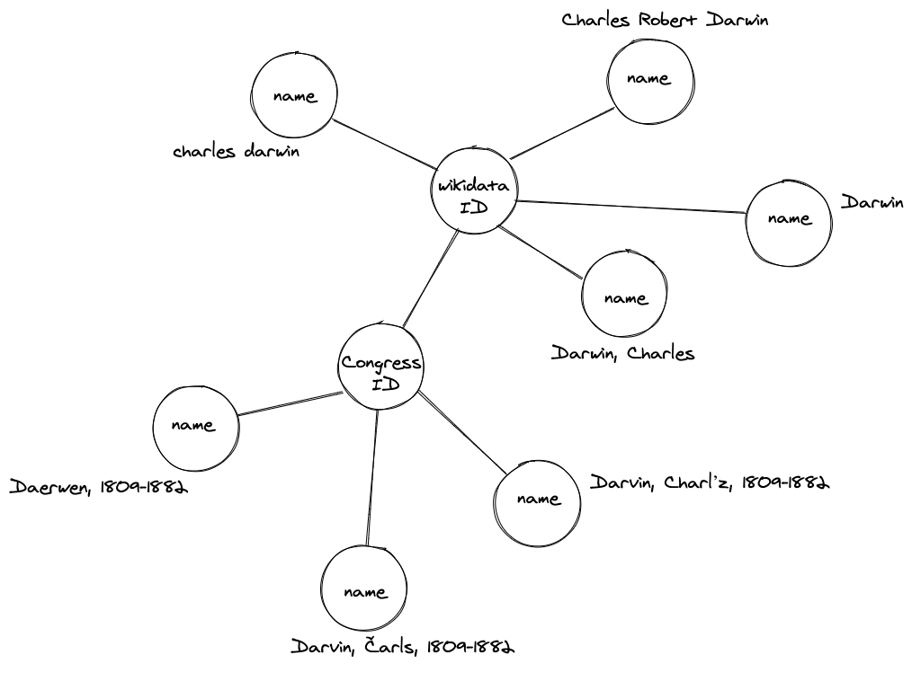

# Graph Structure

As I see it, the best way of representing a concept in the graph store is as follows:



the incoming json might look like:

```json
{
  "label": "charles darwin",
  "type": "name",
  "children": [
    {
      "label": "Q1035",
      "type": "wikidata_id",
      "children": [
        {
          "label": "Charles Robert Darwin",
          "type": "name",
          "children": []
        },
        {
          "label": "Darwin",
          "type": "name",
          "children": []
        },
        {
          "label": "Darwin, Charles",
          "type": "name",
          "children": []
        },
        {
          "label": "n78095637",
          "type": "congress_id",
          "children": [
            {
              "label": "Daerwen, 1809-1882",
              "type": "name",
              "children": []
            },
            {
              "label": "Darvin, Charl'z, 1809-1882",
              "type": "name",
              "children": []
            },
            {
              "label": "Darvin, Čarls, 1809-1882",
              "type": "name",
              "children": []
            }
          ]
        }
      ]
    }
  ]
}
```

Here, each node represents a single piece of information, and the structure of the edges between them represents how they're connected. In this way, each disconnected subgraph in the database represents a single `concept`, being comprised of all of its variant names, identifiers and other metadata which might be added in the future.

When an enricher/other pipeline service sends a query for a known term to the graph store, we ask for all the `name` nodes from the graph that contains the queried node. For example, asking the concepts store for `charles darwin` will return the full list of connected `name`s in the graph above, including `charles darwin`.

This structure should maximise the concepts' versatility, minimise duplication of data, and give us the most freedom to express different relationships _between_ and _within_ concepts.
